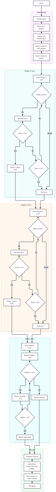
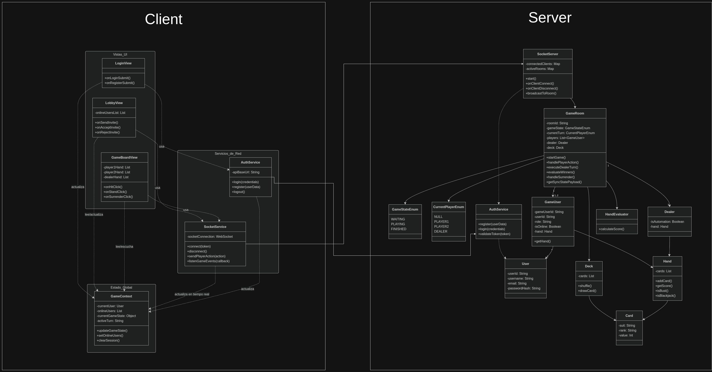

# BlackjackGame

## 1. Descripción

Blackjack, también conocido como 21, es un juego de cartas en el que los jugadores deben obtener un puntaje lo más cercano posible a 21 sin superar ese valor.

Este proyecto implementará una versión multijugador en línea para dos jugadores conectados simultáneamente, utilizando una arquitectura cliente-servidor.

El servidor será responsable de mantener el estado del juego, controlar los turnos, administrar las cartas y determinar el resultado final.

La aplicación debe mantener el mismo estado del juego para ambos jugadores.

---

## 2. Objetivo del juego

El objetivo es obtener un puntaje mayor que el dealer sin superar 21.

Un jugador puede ganar de las siguientes maneras:

* Tener un puntaje mayor que el dealer sin superar 21.
* El dealer supera 21.
* Obtener Blackjack con las primeras dos cartas, siempre que el dealer no tenga Blackjack.

Si el jugador supera 21, pierde automáticamente.

Si el jugador y el dealer tienen el mismo puntaje, el resultado es un empate.

---

## 3. Participantes

Cada partida tendrá:

* 2 jugadores.
* 1 dealer, controlado por el servidor.

Los jugadores estarán conectados al servidor a través de la red.

El dealer no es un usuario real. Sus acciones serán controladas automáticamente de acuerdo con las reglas del juego.

---

## 4. Valores de las cartas

| Carta | Valor  |
| ----- | ------ |
| 2     | 2      |
| 3     | 3      |
| 4     | 4      |
| 5     | 5      |
| 6     | 6      |
| 7     | 7      |
| 8     | 8      |
| 9     | 9      |
| 10    | 10     |
| J     | 10     |
| Q     | 10     |
| K     | 10     |
| A     | 1 u 11 |

### Ases

El As puede valer 1 u 11.

Se utilizará el valor que permita obtener el mejor puntaje posible sin superar 21.

Por ejemplo:

* A + 6 = 17
* A + 9 = 20
* A + K = 21
* A + 9 + 5 = 15

En el último caso, el As pasa a valer 1 para evitar superar 21.

---

## 5. Inicio de una partida

Cuando hay dos jugadores en una partida:

1. El servidor crea una nueva partida.
2. Se crea y se mezcla un mazo.
3. Se asigna una mano al Jugador 1.
4. Se asigna una mano al Jugador 2.
5. Se asigna una mano al dealer.
6. Cada jugador recibe 2 cartas.
7. El dealer recibe 2 cartas.
8. Una carta del dealer permanece visible y la otra permanece oculta.
9. Comienza el turno del primer jugador.

El servidor es responsable de controlar el estado del juego y evitar que los clientes puedan modificarlo directamente.

---

## 6. Turnos de los jugadores

Los jugadores juegan uno después del otro.

El orden será:

**Jugador 1 → Jugador 2 → Dealer → Resultado**

Durante su turno, el jugador puede realizar una de las siguientes acciones:

### Hit

El jugador solicita una carta adicional.

Después de recibir la carta:

* Si el puntaje es menor o igual a 21, puede elegir una acción nuevamente.
* Si el puntaje supera 21, el jugador queda eliminado de la ronda por Bust y su turno termina.
* Si el puntaje es 21, el turno termina automáticamente.

### Stand

El jugador decide no recibir más cartas.

Su puntaje se guarda y su turno termina.

---

## 7. Bust

Un jugador obtiene un Bust cuando su puntaje supera 21.

Ejemplo:

**Jugador:**

10 + 8 + 7 = 25

25 > 21

**Resultado: Bust**

Cuando un jugador obtiene un Bust:

* No puede pedir más cartas.
* Su turno termina.
* Pierde la ronda.

---

## 8. Blackjack

Un jugador tiene Blackjack cuando recibe:

**As + carta con valor de 10**

en sus primeras dos cartas.

Ejemplos:

* A + K = Blackjack
* A + Q = Blackjack
* A + J = Blackjack
* A + 10 = Blackjack

Obtener 21 después de pedir cartas adicionales no se considera Blackjack.

Por ejemplo:

7 + 7 + 7 = 21

Esto es un 21, pero no es Blackjack porque se utilizaron tres cartas.

---

## 9. Turno del dealer

Cuando ambos jugadores terminan sus turnos, comienza el turno del dealer.

El dealer revela la carta oculta.

El dealer sigue reglas automáticas:

* Si el dealer tiene 16 o menos → debe pedir otra carta.
* Si el dealer tiene 17 o más → debe plantarse.
* Si el dealer supera 21 → obtiene un Bust.

El dealer no puede elegir libremente entre pedir otra carta o plantarse.

Para este proyecto, utilizaremos la siguiente regla:

**Dealer <= 16 → HIT**

**Dealer >= 17 → STAND**

El juego utilizará esta regla de manera consistente en todas las rondas.

---

## 10. Determinación del ganador

Una vez que termina el turno del dealer, el servidor compara la mano de cada jugador con la mano del dealer.

### Caso 1: El jugador obtiene un Bust

Jugador > 21

**Resultado: Pierde**

### Caso 2: El dealer obtiene un Bust

Dealer > 21

Jugador <= 21

**Resultado: El jugador gana**

### Caso 3: Ambos tienen 21 o menos

Se comparan sus puntajes.

Ejemplo:

Jugador: 19

Dealer: 17

**Resultado: El jugador gana**

### Caso 4: El dealer tiene un puntaje mayor

Jugador: 17

Dealer: 20

**Resultado: El jugador pierde**

### Caso 5: Mismo puntaje

Jugador: 18

Dealer: 18

**Resultado: EMPATE**

Cada jugador se compara individualmente contra el dealer.

Por ejemplo:

Jugador 1: 18

Jugador 2: 20

Dealer: 18

Jugador 1 → EMPATE

Jugador 2 → GANA

En este caso, el Jugador 1 tiene el mismo puntaje que el dealer, por lo que el resultado es un empate. El Jugador 2 tiene un puntaje mayor que el dealer sin superar 21, por lo que gana.

---

## 11. Salir de una partida

Un jugador puede abandonar una partida en cualquier momento.

Si un jugador abandona:

1. El servidor registra la salida.
2. La partida termina.
3. El jugador restante recibe la victoria.
4. Ambos clientes reciben el resultado final.

---

## 12. Reglas que NO se implementarán inicialmente

Para mantener simple la primera versión, el proyecto no implementará inicialmente:

* Apuestas.
* Dinero virtual.
* Insurance.
* Surrender.
* Double Down.
* Split.
* Apuestas secundarias.

Estas características podrían agregarse posteriormente si el equipo decide extender el proyecto.

---

## 13. Flujo del juego

---

## 14. Estado del juego

El juego debe mantener al menos los siguientes estados:

**WAITING**

↓

**PLAYING**

↓

**DEALER_TURN**

↓

**FINISHED**

También se debe considerar el estado de un jugador que abandona la partida.

El servidor será la fuente principal del estado del juego y deberá mantener sincronizados a ambos clientes.

---

## 15. Reglas importantes de implementación

Para evitar inconsistencias entre los miembros del equipo:

1. El cliente no decide quién gana.
2. El cliente no modifica directamente el estado del juego.
3. El servidor controla las cartas.
4. El servidor controla los turnos.
5. El servidor calcula los puntajes.
6. El servidor determina el resultado.
7. Ambos clientes reciben actualizaciones del estado del juego.
8. Un jugador solo puede realizar acciones durante su turno.
9. Una acción enviada fuera de turno debe ser rechazada.
10. Una partida finalizada no debe acepta

---

## 16. Referencias

Como referencia para comprender las reglas generales del blackjack::

[Video de referencia sobre el blackjack](https://www.youtube.com/watch?v=ifVklNuHDOM)

La implementación de este proyecto seguirá las normas definidas en este documento.

---

## 17. Arquitectura

